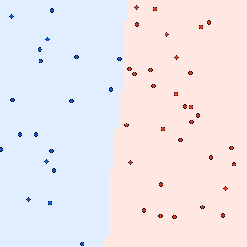
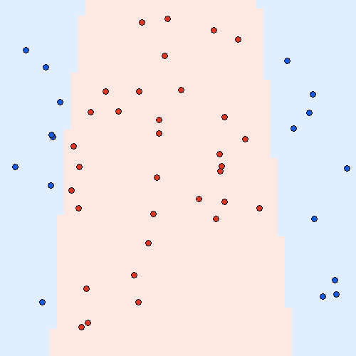
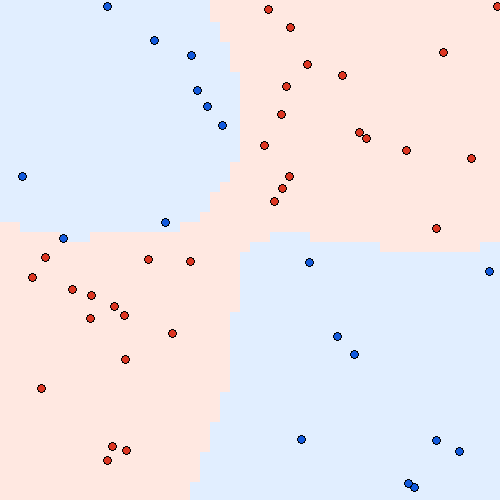

# MiniTorch Module 1


* Docs: https://minitorch.github.io/

* Overview: https://minitorch.github.io/module1/module1/

This assignment requires the following files from the previous assignments. You can get these by running

```bash
python sync_previous_module.py previous-module-dir current-module-dir
```

The files that will be synced are:

        minitorch/operators.py minitorch/module.py tests/test_module.py tests/test_operators.py project/run_manual.py

## task 1.5

trained on 50 points with 10 hidden units, rate 0.5 and 500 epochs:

```text
Simple  loss=0.520383  correct=50/50  0.03481 sec/epoch
Diag    loss=0.159108  correct=50/50  0.03488 sec/epoch
Split   loss=0.532957  correct=50/50  0.03511 sec/epoch
XOR     loss=1.868249  correct=49/50  0.03507 sec/epoch
```





